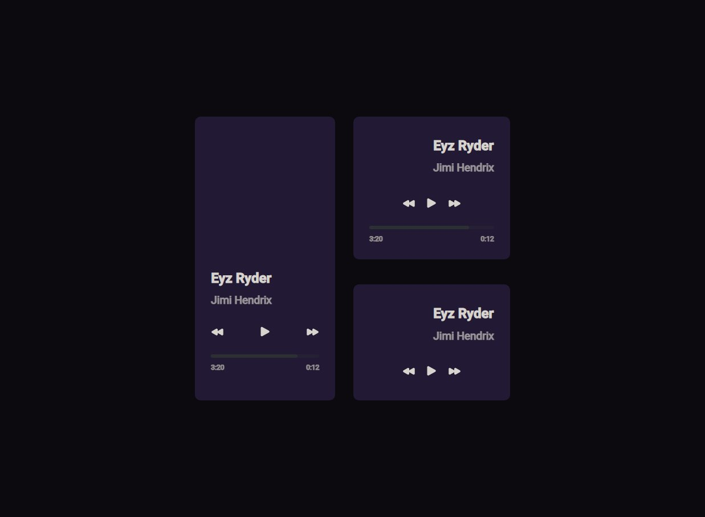

# Bora codar 01 - Player de música

Primeiro projeto dos desafios semanais, o #boracodar é um espaço para mostrar nossas habilidades na programação.
So foi um questão simples de layout mas planejo colocar a função de tocar musica mesmo.

  

## 🚀 Tecnologias

- HTML 5
- CSS 3
- Tailwindcss
