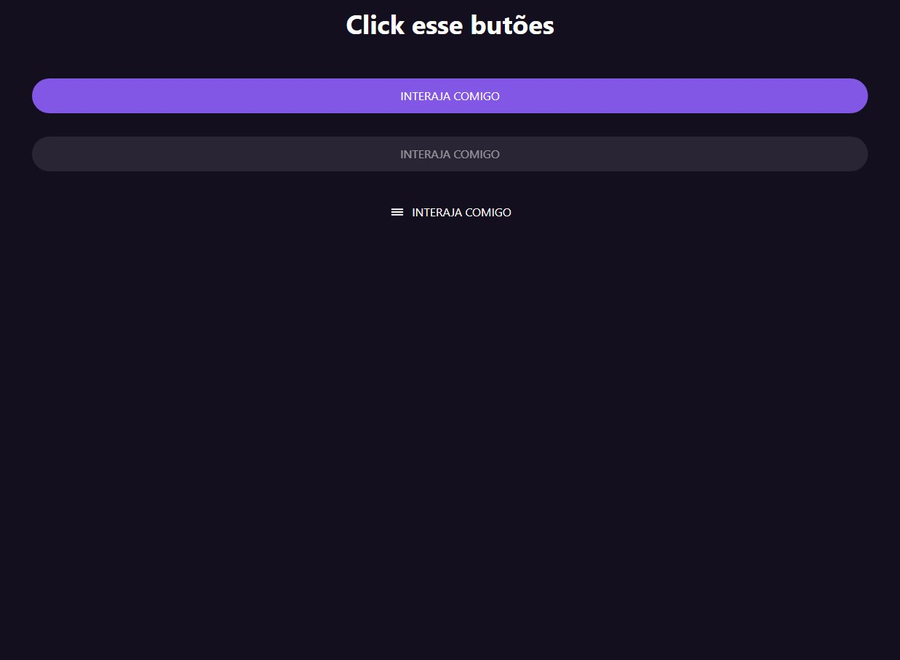

# Bora codar 03 - Butões e cursores

  

## Sobre

Terceiro projeto dos desafios semanais, o #boracodar é um espaço para mostrar nossas habilidades na programação.
O desafio foi de testar a mudança dos atributos nos butoes e cursores

## 🚀 Tecnologias
- HTML 5
- CSS 3
- Tailwindcss