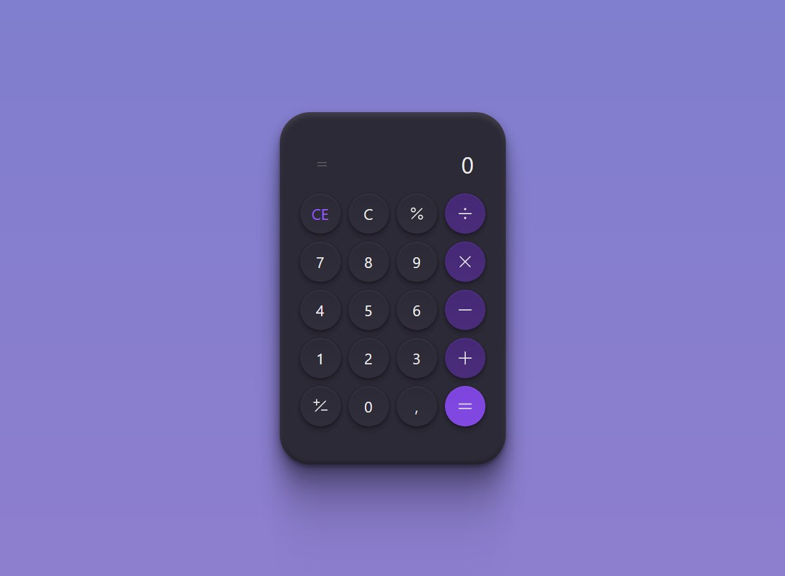

# Bora codar 05 - Um calculador

  

## Sobre

Quinto projeto dos desafios semanais, o #boracodar é um espaço para mostrar nossas habilidades na programação.
O desafio foi desta fez foi de fazer um calculador functional.

## 🚀 Tecnologias
- HTML 5
- CSS 3
- JavaScript
- Tailwindcss